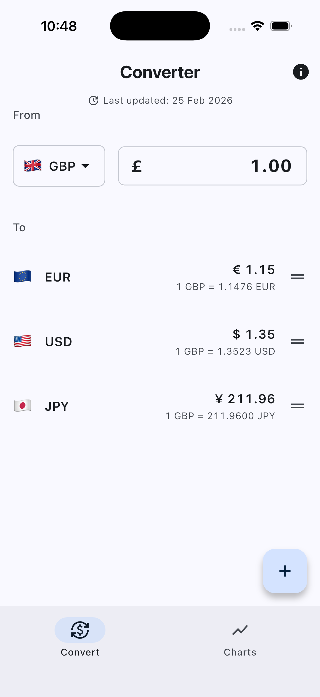
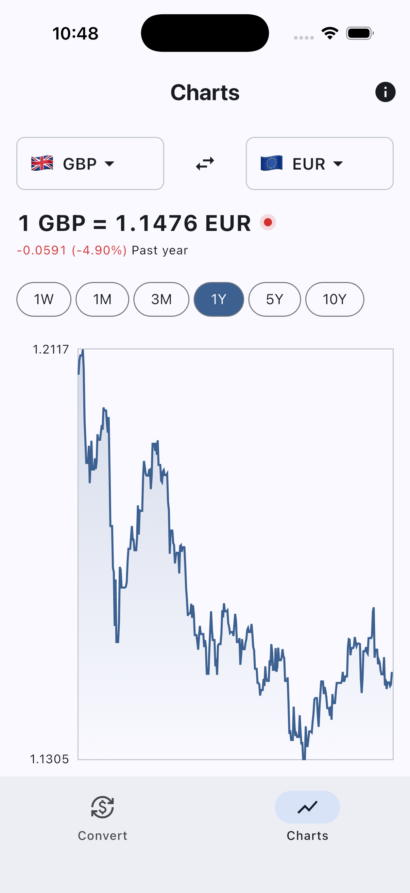

# Currency Converter

A Flutter app for real-time currency conversion and historical exchange rate charts, powered by the [Frankfurter API](https://frankfurter.dev/).

## Features

- **Convert** — Live currency conversion with support for multiple target currencies and drag & drop reordering
- **Charts** — Interactive line charts with selectable time ranges (1D to 10Y)

  
  

### [LICENSE: MIT](LICENSE.md)