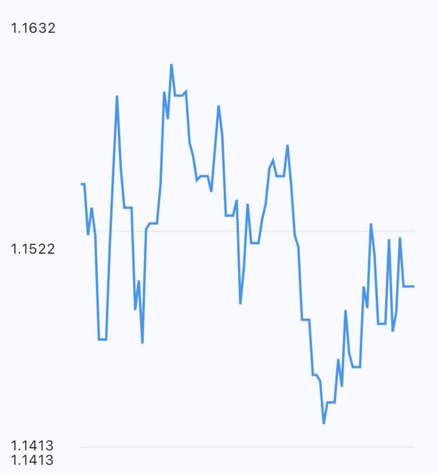

# Chart Y-Axis Labels Fix - Complete Journey

## Problem

The chart y-axis was showing duplicate labels in some cases. For example, the bottom label "1.1413" appeared twice, resulting in 4 labels instead of 3 (top, middle, bottom).



## Root Cause

The original implementation used a **tolerance-based approach** to determine which labels to show:

```dart
// Original problematic code
final padding = (maxRate - minRate) * 0.1;
final yMin = minRate - padding;
final yMax = maxRate + padding;

getTitlesWidget: (value, meta) {
  if ((value - yHigh).abs() < padding / 2) {
    return Text(yHigh.toStringAsFixed(4), ...);
  } else if ((value - yMedium).abs() < padding / 2) {
    return Text(yMedium.toStringAsFixed(4), ...);
  } else if ((value - yLow).abs() < padding / 2) {
    return Text(yLow.toStringAsFixed(4), ...);
  }
  return const SizedBox.shrink();
}
```

### Why This Failed

From debug logs, we discovered that fl_chart calls `getTitlesWidget` for each grid value it generates:

```
[log] value: 1.14127, meta min: 1.14127, max: 1.16323
[log] value: 1.1420000000000001, meta min: 1.14127, max: 1.16323
[log] value: 1.1440000000000001, meta min: 1.14127, max: 1.16323
...
```

**The problem**: Multiple consecutive callback values (1.14127 and 1.1420000000000001) both fell within the tolerance range of `yLow`, causing duplicate labels.

## Key Learnings

### 1. Understanding fl_chart's Callback Mechanism

The `getTitlesWidget` callback is invoked by fl_chart for **each grid value** it generates internally. We cannot directly control which values fl_chart passes to this callback—we can only influence them through configuration parameters like `horizontalInterval`.

### 2. The meta Object

The `meta` parameter provides crucial information:
- `meta.min` - The actual minimum value fl_chart uses for the axis
- `meta.max` - The actual maximum value fl_chart uses for the axis

These values are guaranteed to be included in the callback sequence and can be matched with exact equality.

### 3. Tolerance-Based Matching is Unreliable

Any tolerance-based approach (e.g., `(value - target).abs() < threshold`) can match multiple consecutive grid values, leading to duplicate labels.

### 4. Grid Value Generation Control

fl_chart's grid value generation depends on configuration:
- **Without `horizontalInterval`**: fl_chart uses its own algorithm to generate "nice" values
- **With `horizontalInterval`**: fl_chart generates values at `min + n * interval` where n = 0, 1, 2, ...

This is crucial for controlling which values appear in callbacks.

## All Attempted Approaches

### Approach 1: Tolerance-Based with Padding (Original - FAILED)

```dart
final padding = (maxRate - minRate) * 0.1;
if ((value - yHigh).abs() < padding / 2) { ... }
```

**Why it failed**: Multiple consecutive callback values fell within tolerance range, causing duplicates.

### Approach 2: Median from Sorted Data Points (FAILED)

```dart
final sortedRates = [...rates]..sort();
final medianRate = sortedRates[sortedRates.length ~/ 2];

if (value == medianRate) { ... }
```

**Why it failed**: The `medianRate` calculated from data points may not be in fl_chart's callback sequence. fl_chart generates its own grid values independently of the data.

### Approach 3: Sentinel-Based "Closest to Midpoint" (FAILED - TOO COMPLEX)

```dart
double? closestToMidpoint;
var minDistance = double.infinity;

getTitlesWidget: (value, meta) {
  final midpoint = (meta.min + meta.max) / 2;
  final distance = (value - midpoint).abs();
  if (distance < minDistance) {
    minDistance = distance;
    closestToMidpoint = value;
  }

  if (value == closestToMidpoint && !medianLabelShown) { ... }
}
```

**Why it failed**: Overcomplicated tracking logic. State management across callback invocations is fragile. Updating `closestToMidpoint` during rendering feels like a code smell.

### Approach 4: Simple Sentinel "First Above Midpoint" (FAILED - STILL COMPLEX)

```dart
var medianLabelShown = false;

if (value > midpoint && !medianLabelShown) {
  medianLabelShown = true;
  return SideTitleWidget(...);
}
```

**Why it failed**: While simpler than approach 3, it still relies on fl_chart's arbitrary value generation. The "first value above midpoint" might not be visually centered. Still requires sentinel state management.

### Approach 5: Exact Equality on Calculated Middle Value (FAILED)

```dart
final horizontalInterval = (yMax - yMin) / 2;
final middleValue = yMin + horizontalInterval;

checkToShowHorizontalLine: (value) {
  return value == middleValue;
}
```

**Why it failed**: Without setting `horizontalInterval` in the grid configuration, fl_chart generates its own values that don't include our calculated `middleValue`. The equality check never matches.

**Debug output showed**:
```
[log] value: 1.141
[log] value: 1.143
[log] value: 1.145
...
// Our middleValue might be 1.14725, which never appears
```

### Approach 6: Understanding horizontalInterval Control

**Key discovery**: We must set `horizontalInterval` in `FlGridData` to control which values fl_chart generates:

```dart
gridData: FlGridData(
  horizontalInterval: (yMax - yMin) / 2,
  // Now fl_chart generates: yMin, yMin + interval, yMax
)
```

With this configuration, we could:
- Use `checkToShowHorizontalLine: (value) => value > yMin && value < yMax` to show only middle line
- Use range check in `getTitlesWidget` to show middle label

**However**, this added complexity and we decided on a simpler approach.

## The Final Solution

### Simple and Deterministic: Two Labels Only

After all these attempts, we realized the cleanest solution is to show only **two labels** (min and max) with **BorderData** for visual boundaries:

```dart
// Calculate min/max directly from data (no padding)
final rates = dataPoints.map((p) => p.rate).toList();
final yMin = rates.reduce((a, b) => a < b ? a : b);
final yMax = rates.reduce((a, b) => a > b ? a : b);

getTitlesWidget: (value, meta) {
  if (value == meta.min || value == meta.max) {
    return SideTitleWidget(
      meta: meta,
      child: Text(
        value.toStringAsFixed(4),
        style: Theme.of(context).textTheme.bodySmall,
      ),
    );
  }
  return const SizedBox.shrink();
}

gridData: FlGridData(show: false),
borderData: FlBorderData(
  show: true,
  border: Border.symmetric(
    horizontal: BorderSide(
      color: Theme.of(context).colorScheme.outlineVariant,
      width: 1,
    ),
  ),
),
```

### Key Changes

1. **No padding**: Removed the 10% padding calculation. Using exact min/max from data shows the actual data range.

2. **Exact equality on meta values**: Checking `value == meta.min || value == meta.max` ensures only two labels are shown.

3. **SideTitleWidget**: Using `SideTitleWidget` instead of plain `Text` for proper axis positioning and alignment.

4. **No middle label**: Simplified to show only top and bottom labels.

5. **BorderData for visual boundaries**: Provides clear, reliable horizontal lines at exact min/max positions.

### Why This Solution is Best

1. **Simplicity**: No sentinel flags, no tolerance checks, no complex state tracking
2. **Reliability**: `meta.min` and `meta.max` are guaranteed to appear in callbacks
3. **No duplicates possible**: Exact equality with OR condition prevents any duplication
4. **Clean visual design**: BorderData provides clear boundaries without grid complexity
5. **Maintainable**: Future developers will understand this code immediately
6. **Performance**: Minimal conditional logic, no distance calculations

### Visual Separation with BorderData

BorderData is the **only reliable way** to draw lines at exact min/max positions:

```dart
borderData: FlBorderData(
  show: true,
  border: Border.symmetric(
    horizontal: BorderSide(
      color: Theme.of(context).colorScheme.outlineVariant,
      width: 1,
    ),
  ),
),
```

This approach:
- Draws lines at **exactly** yMin and yMax (no grid value generation involved)
- Aligns perfectly with the min/max labels
- Provides consistent styling through theme
- Works independently of any grid configuration
- Creates a clean, professional appearance

## Why We Removed the Middle Label

After extensive experimentation, we decided that:

1. **Two labels are sufficient**: Min and max provide essential range information
2. **Middle label adds complexity**: All approaches required either tolerance checks, sentinel flags, or interval configuration
3. **Visual clarity**: Two clear boundaries are easier to read than three lines
4. **Data density**: For financial charts, the actual data line is more important than grid infrastructure

## Implementation Files

- Chart widget: `lib/src/screens/charts/exchange_rate_chart.dart:94-106`
- Border configuration: `lib/src/screens/charts/exchange_rate_chart.dart:122-130`

## If Middle Label is Needed in Future

If business requirements demand a middle label and grid line:

### The Correct Approach

```dart
final horizontalInterval = (yMax - yMin) / 2;
var middleLabelShown = false;

gridData: FlGridData(
  show: true,
  drawVerticalLine: false,
  horizontalInterval: horizontalInterval,  // CRITICAL: Must set this
  checkToShowHorizontalLine: (value) {
    // Only show middle line (BorderData handles min/max)
    return value > yMin && value < yMax;
  },
  getDrawingHorizontalLine: (value) {
    return FlLine(
      color: Colors.grey.withValues(alpha: 0.2),
      strokeWidth: 1,
    );
  },
),

getTitlesWidget: (value, meta) {
  if (value == meta.min) {
    return SideTitleWidget(...);
  } else if (value > meta.min && value < meta.max && !middleLabelShown) {
    middleLabelShown = true;  // Guarantee only one middle label
    return SideTitleWidget(...);
  } else if (value == meta.max) {
    return SideTitleWidget(...);
  }
  return const SizedBox.shrink();
}
```

### Why This Would Work

1. **horizontalInterval controls generation**: Setting it makes fl_chart generate exactly 3 values
2. **Range check is robust**: `value > yMin && value < yMax` matches the middle value without exact equality
3. **BorderData handles boundaries**: Top and bottom lines via borders, middle via grid
4. **Sentinel prevents duplicates**: Even if range check matches multiple times, only one label appears

### Critical Lessons

- **Cannot use exact equality on calculated values** without setting `horizontalInterval`
- **Must separate concerns**: BorderData for boundaries, gridData for middle line only
- **Range checks are more robust** than exact equality for middle values
- **Always use sentinel flags** when showing labels between min and max

## Conclusion

The journey taught us that **simpler is better**. While we explored many sophisticated approaches for adding a middle label, the cleanest solution is:

1. Show only `meta.min` and `meta.max` labels (guaranteed to exist)
2. Use `BorderData` for visual boundaries (guaranteed positioning)
3. Avoid tolerance checks, sentinel state, and complex grid logic

The key insight: **fl_chart controls value generation, so work with what it guarantees** (`meta.min`, `meta.max`) rather than fighting to match arbitrary calculated values.

This solution is simple, deterministic, maintainable, and guarantees no duplicate labels while providing a clean, professional presentation.
